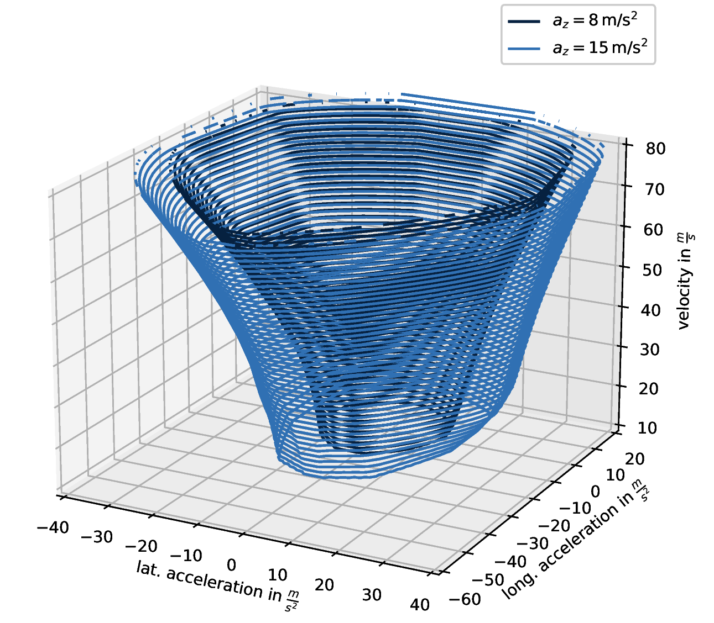
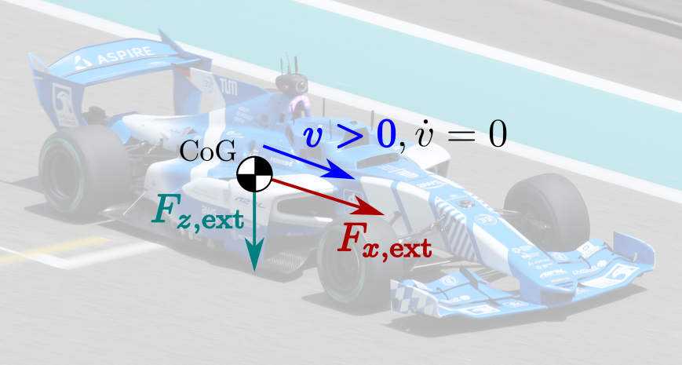
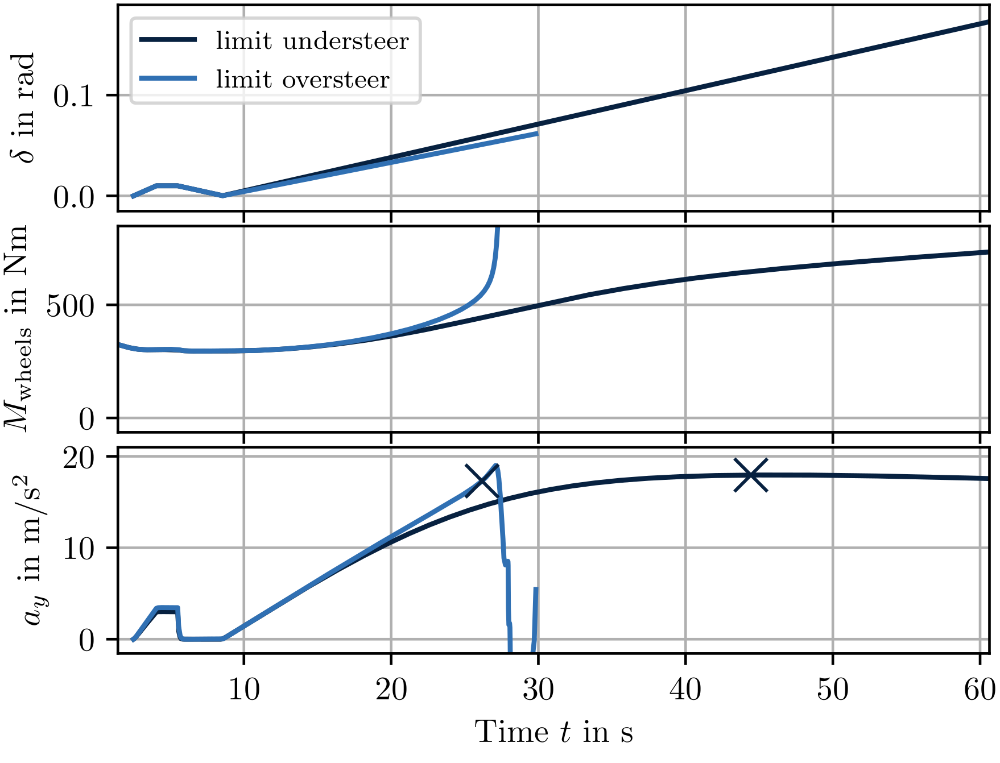
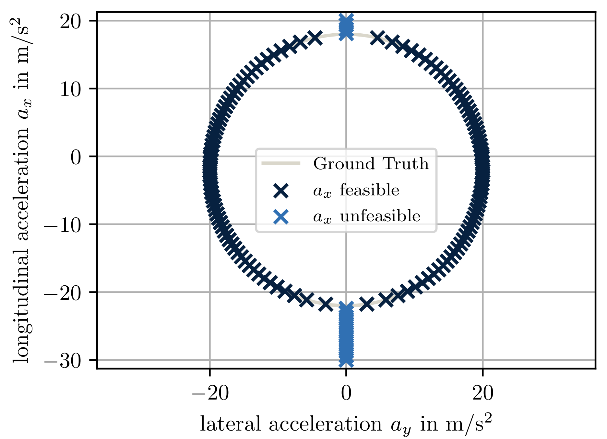
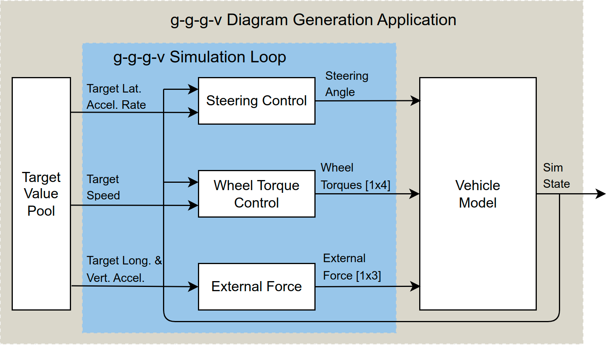

# Quasi-Steady-State Black Box Simulation for the Generation of g-g-g-v Diagrams

# Introduction
The g-g diagram visualizes the maximum longitudinal
and lateral accelerations that a vehicle can achieve. To address non-planar
road geometries, this concept can be extended to incorporate
g-g constraints as a function of vehicle speed and vertical
acceleration, commonly referred to as g-g-g-v diagrams. This repository provides a parallelized black box simulation toolchain to generate QSS g-g-g-v diagram. Our approach enables the use of existing high-fidelity vehicle models without the need for differentiability, avoiding model mismatch problems.



## Basic Functionality
The core functionality involves a fully factorial batch execution of steering ramp maneuvers across specified ranges of velocity (`v`), longitudinal acceleration (`ax`), and vertical acceleration (`gt`). 

In the simulation, the vehicle maintains a quasi-steady-state at the target speed through external forces applied to its center of gravity, emulating inertial forces via the targeted longitudinal acceleration. A drive torque controller compensates for resistance forces to sustain the target speed.



## Simulation Process
Each simulation starts with a small steering step. The resulting lateral acceleration jump calculates an appropriate steering ramp speed, achieving a controlled lateral acceleration rise rate essential for quasi-static driving conditions. The maximum lateral acceleration recorded in each simulation becomes the result.

- **Stable Runs:** The maximum recorded lateral acceleration is used as the result.
- **Unstable Runs:** If instability is detected, the last known stable lateral acceleration is taken as the result.




# Tutorial
## Setup and Build Instructions

Follow these steps to create a virtual environment, install dependencies, and build the project using Colcon on Ubuntu.

### 1. Create a Python Virtual Environment

Run the following command to create a virtual environment named venv:
```
python3 -m venv venv
```

### 2. Activate the Virtual Environment

Activate the virtual environment with:
```
source venv/bin/activate
```
### 3. Install Dependencies

Once the virtual environment is activated, install the required packages:
```
pip install -r requirements.txt
```
### 4. Add a COLCON_IGNORE File

To prevent Colcon from processing the virtual environment, create an empty COLCON_IGNORE file inside the venv/ folder:
```
touch venv/COLCON_IGNORE
```
### 5. Build the Project

Run Colcon to build the workspace:
```
colcon build
```
## Run the simualtion
1. Check/Modify the parameter files located in the ``./params`` folder.
2. Run ``main_gggv_generation.py``. Output files are created in the ``output`` folder (folder is created if it does not exist).

## Analyzing the results
The script ``plot_comparion.py`` can be used to compare one or multiple simulation runs with each other. Simply run the script and follow the instuctions. The comparisons are based on the diamond shape of the limitations. 

## Debugging Single Simulation Steps
To look into a single simulation run you can switch the program from batch execution to simulate a single steering ramp. Follow these instructions:
1. Switch the `singlerun` parameter in the header of `main_gggv_generation.py` from `False` to `True`
2. Specify the velocity `v`, longitudinal acceleration `ax`, and the vertical acceleration `gt`

## Vehicle Dynamics Model 

## Vehicle Dynamics Model 
The vehicle dynamics model included in this repository is a simple validation vehicle model, which can be solved analytically. The model is depicted in the figure below.



The validation vehicle model is a simple bicycle model with a fixed wheel base and center of gravity height. The vehicle is actuated by a steering angle and two wheel torques. The model is solved analytically using the equations of motion.

To use your own vehicle model with this toolchain, you need to provide a model that can be actuated by wheel torques and a steering angle. Furthermore, your model needs to allow external forces to be superimposed onto the center of gravity. The overall simulation process is depicted in the figure below.



## Integrating Your Own Vehicle Model
1. In the `sim_handler` class in the file 'src/sim_handlin.py' class, you will need to instantiacte your vehicle model in the __init__ function of the sim_handler class
2. Update the following member function of the sim_handler class to your naming conventions:
    - get_veh_params()
    - set_parameter() 
    - set_driver_input()
    - get_simstate()
3. In `main_gggv_generation.py` replace the vehicle step function call